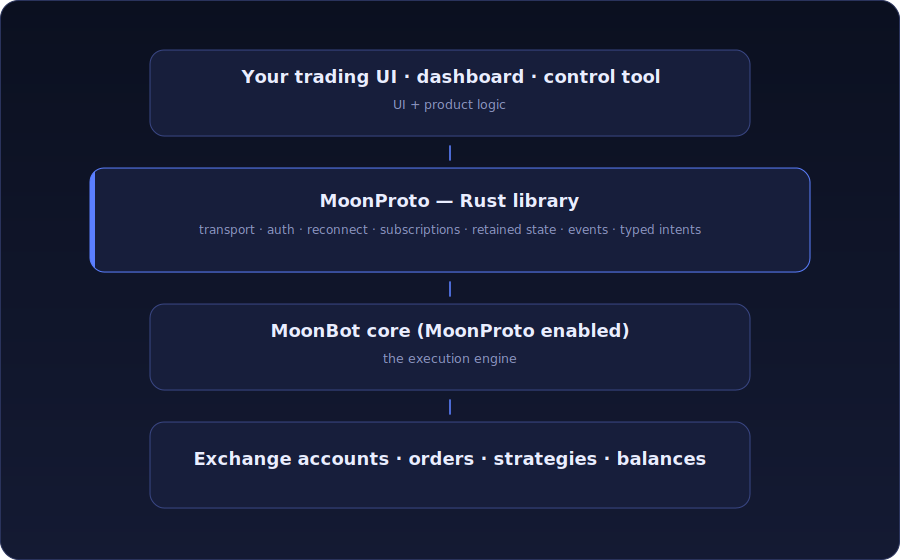

<p align="center">
  <a href="https://moonbot.pro">
    
  </a>
</p>

<h1 align="center">MoonProto</h1>

<p align="center">
  <b>Client-side Rust runtime SDK for building MoonBot-compatible terminals, dashboards, and control tools</b><br>
  over a running MoonBot core
</p>

<p align="center">
  <a href="LICENSE"></a>
  
  
  
</p>

<p align="center">
  <a href="#overview">Overview</a> ·
  <a href="#what-the-library-provides">What it provides</a> ·
  <a href="#quick-start">Quick start</a> ·
  <a href="#examples">Examples</a> ·
  <a href="#documentation">Docs</a> ·
  <a href="#build--test">Build</a> ·
  <a href="#license">License</a>
</p>

MoonProto is the live client-side bridge to a MoonBot core. The core remains the execution engine — it connects to exchanges and owns orders, strategies, risk logic, balances, and authoritative trading state. MoonProto keeps your terminal or tool connected to that core: transport, authorization, reconnect, subscriptions, retained state, events, and typed user intents.

<p align="center">
  
</p>

This is not a thin REST-style wrapper around a dozen commands. A trading terminal needs continuously maintained state — markets, balances, orders, orderbooks, trades, candles, settings, strategies, reconnect recovery, and delivery guarantees. MoonProto keeps that live client-side model for you, so your application can focus on UI and product logic.

## Overview

Your application does not talk to exchanges directly through this crate. It talks to a MoonBot core that is already running with MoonProto enabled.

**MoonProto owns the live client runtime** — it connects and authorizes, restores after reconnect, subscribes to streams, applies incoming packets into retained state, publishes snapshots and events, and sends typed user intents back to the core.

**Your application owns** the UI, the product workflow, local persistence and preferences, and the presentation of markets, orders, charts, alerts, and settings.

Because MoonProto already owns the runtime, a terminal normally does **not** create its own polling "feed thread" on top of the library. Integrate events with your UI framework through `MoonEventSink`, and read snapshots from the UI's normal update/render path. The `drain_events() + sleep(...)` style used by small examples is a CLI/demo loop, not the recommended architecture for a real-time terminal.

## What The Library Provides

Application code usually works with:

- **`MoonClient`** — the connection/runtime owner.
- **Snapshots and events** — current markets, balances, orders, trades, orderbooks, candles, strategies, settings, news/tags, core health, and UI/chart facts.
- **Typed intents** — subscribe, place / cancel / move order, refresh assets, update settings.

Internally, the crate contains the transport modes V0/V1/V2, handshake / authorization / reconnect / liveness handling, reliable sliced datagrams with ACK/retry over UDP, typed binary command parsers and builders, the retained read-model state, and the owned runtime session API.

### Transport modes

MoonProto has built-in transport modes **V0**, **V1**, and **V2**. The selected client mode must match the server-side connection setting; unsupported mode values normalize to `V0`.

## Quick Start

### Credentials

**Do not commit live keys or server addresses.** For examples, pass credentials on the command line:

```powershell
cargo run --release --example trading_flow -- "<exported MoonBot key>" "HOST:PORT"
```

`<exported MoonBot key>` is the base64 key string exported by MoonBot and parsed by `moonproto::import_key`. Current MoonBot exports can also include a suggested UDP endpoint and transport mode; UI code can read those with `moonproto::parse_key_info`, then still let the user edit host, port, and mode before connecting.

For live tests, keep the config **outside** this crate repo (so credentials never enter commits or packages). FireTest reads `../moonproto.firetest.conf` by default, overridable with `MOONPROTO_FIRETEST_CONFIG`:

```text
server = HOST:PORT
key = <exported MoonBot key>
```

### Application shape

```rust
use moonproto::{
    parse_key_info, ClientConfig, ConnectConfig, InitConfig, InitialStrategies,
    MoonClient, MoonEventSink, TradesStreamMode, TransportMode,
};

fn start_moonproto(
    ui_sink: MoonEventSink,
) -> Result<MoonClient, Box<dyn std::error::Error>> {
    let key_b64 = std::env::var("MOONPROTO_KEY")?;
    let info = parse_key_info(&key_b64).expect("invalid MoonBot key");
    let suggested_network = info.network;

    let host = std::env::var("MOONPROTO_HOST").ok().or_else(|| {
        suggested_network
            .and_then(|network| network.address.map(|ip| ip.to_string()))
    }).unwrap_or_else(|| "127.0.0.1".to_string());
    let port = std::env::var("MOONPROTO_PORT")
        .ok()
        .and_then(|v| v.parse().ok())
        .or_else(|| suggested_network.map(|network| network.port))
        .unwrap_or(3000);
    let transport_mode = suggested_network
        .map(|network| network.transport_mode)
        .unwrap_or(TransportMode::V0);

    let cfg = ClientConfig::new(host, port, info.keys.master_key, info.keys.mac_key)
        .with_transport_mode(transport_mode);

    let client = MoonClient::connect_with_sink(
        cfg,
        ConnectConfig::new(InitConfig {
            // An empty list explicitly means that this application has no
            // local strategies. Otherwise pass their current epoch and rows.
            initial_strategies: Some(InitialStrategies::new(0, Vec::new())),
            subscribe_trades: Some(TradesStreamMode::TradesOnly),
            // Use TradesAndMarketMakers when the terminal needs MoonBot-style
            // heat-map rows with HyperLiquid taker wallet addresses.
            subscribe_orderbooks: vec!["BTCUSDT".to_string()],
            ..Default::default()
        }),
        ui_sink,
    )?;

    // Keep this handle in application state. The sink delivers Ready and
    // domain events into the framework's own event loop.
    Ok(client)
}
```

Create `ui_sink` with `MoonEventSink::callback` for callback/event-loop frameworks, or `MoonEventSink::queue_with_waker` for immediate-mode frameworks. Store the returned `MoonClient` in application state. When the sink delivers `LifecycleEvent::Ready`, the UI can read `client.snapshot()` and issue intents such as `client.streams().subscribe_orderbook(...)`, `client.trade().new_order(...)`, or `client.orders().move_order(...)`.

`MoonClient` owns the runtime thread and `connect_with_sink` returns immediately. Init is one-time per session; readiness arrives through the sink as `LifecycleEvent::Ready`. After Init, reconnect restore, market refresh, saved subscriptions, orderbook full resync, trades gap recovery, and pending Engine API dispatch are owned by the library until `disconnect()` or drop. See [`docs/active_lib.md`](docs/active_lib.md) for the maintained-state contract. CLI tools and one-shot scripts may use `MoonClient::connect_blocking`; UI code should not block its event loop on network readiness.

Engine API helpers that mutate server/exchange state also run through the owned runtime and return immediately after queuing the intent; completion arrives as `Event::EngineAction`. Examples: `client.account().set_leverage(...)`, `client.account().set_hedge_mode(...)`, `client.account().cancel_all_orders(...)`, `client.account().confirm_risk_limit(...)`, `client.balances().transfer_asset(...)`.

## Examples

Runnable live/manual examples live in [`examples/`](examples). Run them with a key and `HOST:PORT`; some take extra positional args:

```powershell
cargo run --release --example trading_flow   -- "<key>" "HOST:PORT"
cargo run --release --example list_markets   -- "<key>" "HOST:PORT" 20
cargo run --release --example order_book_top -- "<key>" "HOST:PORT" BTCUSDT 30
cargo run --release --example trades_stream  -- "<key>" "HOST:PORT" all 30
cargo run --release --example history_bars   -- "<key>" "HOST:PORT" BTCUSDT 1h
```

| Example | What it shows |
|---|---|
| [`trading_flow`](examples/trading_flow.rs) | Compact `MoonClient` application flow. |
| [`list_markets`](examples/list_markets.rs) | Market catalog from `MoonClient::snapshot`. |
| [`market_refresh`](examples/market_refresh.rs) | Background market-refresh events/snapshots. |
| [`trades_stream`](examples/trades_stream.rs) | Trades subscription and retained market tail. |
| [`order_book_stream`](examples/order_book_stream.rs) · [`order_book_top`](examples/order_book_top.rs) | Orderbook stream / read model. |
| [`history_bars`](examples/history_bars.rs) | Retained candle/history read path. |
| [`order_snapshot`](examples/order_snapshot.rs) | Fresh order snapshot through `MoonClient`. |
| [`cancel_open_order`](examples/cancel_open_order.rs) | Tracked cancel intent through `client.orders()`. |
| [`multi_client_test`](examples/multi_client_test.rs) | Two independent `MoonClient` runtimes. |

## Documentation

Public API notes live in [`docs/`](docs). Start here:

| Doc | Topic |
|---|---|
| [overview](docs/overview.md) | The big picture. |
| [client](docs/client.md) | `MoonClient` and the owned runtime. |
| [events](docs/events.md) · [lifecycle](docs/lifecycle.md) | Events, snapshots, and session lifecycle. |
| [markets](docs/markets.md) · [trades](docs/trades.md) · [order_books](docs/order_books.md) | Market data read-models. |
| [orders](docs/orders.md) · [candles](docs/candles.md) · [reports](docs/reports.md) | Orders, candle history, reports. |
| [news](docs/news.md) | Retained/live news JSON and the tags catalog. |
| [engine_api](docs/engine_api.md) · [strats](docs/strats.md) | Server/exchange mutations and strategies. |
| [time](docs/time.md) · [multi_server](docs/multi_server.md) | Clock handling and multi-server setups. |

Additional topics: [`active_lib`](docs/active_lib.md), [`arb`](docs/arb.md), [`balances`](docs/balances.md), [`trade_actions`](docs/trade_actions.md), [`ui`](docs/ui.md).

## Build & Test

```powershell
cargo build
cargo build --release
cargo test --lib
cargo check --examples
```

Packaging sanity check (the package contains only crate files — keep credentials in local config outside the tree):

```powershell
cargo package --allow-dirty
```

**Deterministic tests:**

```powershell
cargo test --lib
cargo test --test udp_polling
```

**Live smoke test** (needs a live server + key):

```powershell
$env:MOONPROTO_LIVE_SERVER = "HOST:PORT"
$env:MOONPROTO_KEY = "<exported MoonBot key>"
cargo test --test integration_smoke -- --ignored --nocapture
```

**FireTest** — the main live health test for the active library (requires the `diagnostics` feature; regular applications do not need it):

```powershell
$env:MOONPROTO_FIRETEST_PROFILE = "quick"
cargo test --release --features diagnostics --test fire_test -- --ignored --nocapture
```

- **Quick profile** (< 30 s, one client) — connect / AuthDone / InitDone, base/auth checks, markets & server-index map, strategy schema apply, trades & orderbook subscriptions, retained trades/price/history, MarkPrice + funding/balance/order UI state, `ParseFailed == 0`, and a PMTU + CPU summary (`>5 ms` in protocol/apply sections is a hard red flag).
- **Full profile** (destructive/stress, `allow_mutation = true`) — two live clients, `err_emu` packet loss (10% → 50%), chunked candles under loss, settings/strategy broadcast, an emulator order lifecycle, and a real SOLUSDT safety gate: place a $1000 long limit 5% below market, cancel it through the tracked ActiveLib order path, and verify that balance changes arrive without a manual balance request. It also exercises simple operations at 50% loss, forced reconnect and post-reconnect delivery, plus sliced/retry/parse/PMTU/CPU diagnostics; `>5 ms` in protocol/apply sections is a hard red flag.

Set `MOONPROTO_FIRETEST_ERR_EMU=0` to disable the client-side packet-loss emulation (default 10%). FireTest writes strategy diagnostics under `target/` (`firetest_strategy_info_<profile>.txt`, `firetest_strategy_raw/`). See [`tests/README.md`](tests/README.md) for the full test-layer map and [`tests/fire_test.rs`](tests/fire_test.rs) for scenario-specific overrides.

## Repository Layout

```text
src/client/       active client/session, init, reconnect, send/receive paths
src/commands/     typed MoonProto command parsers/builders
src/events/       public events and immutable state snapshots
src/state/        read-model state: markets, trades, books, orders, balances
src/transport/    built-in low-level transport modes V0/V1/V2
tests/            integration, polling, and FireTest
examples/         runnable live/manual examples
docs/             API documentation
```

## Development Notes

- V0/V1/V2 transport modes are built in; the selected client and server modes must match.
- Keep live credentials outside the public repo.
- Run the quick FireTest at important checkpoints; run the full FireTest before calling a protocol build stable.

## License

Licensed under the **Apache License, Version 2.0** — see [`LICENSE`](LICENSE). Redistributions must preserve the attribution notice from [`NOTICE`](NOTICE) per Apache-2.0 section 4(d).

---

<p align="center">
  <strong>Moonbot</strong> · the client SDK behind <a href="https://github.com/Moonbot-Tech/MoonTerminal">MoonTerminal</a> · <a href="https://moonbot.pro">moonbot.pro</a>
</p>
